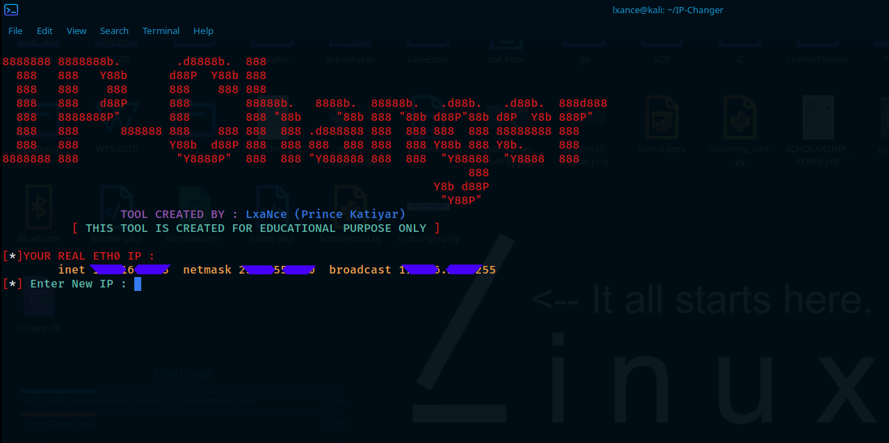

# IP-Changer
Using this tool, U can change your physical ip address 😉
### THIS TOOL IS CREATED FOR EDUCATIONAL PURPOSE, DON'T MISUSE IT.
<p align="center">
  
</p>

## Installing Process 👇
```$ git clone https://github.com/LxaNce-Hacker/IP-Changer```<br>
```$ apt-get install pv```<br>
## Running Process 👇
```$ cd IP-Changer```<br>
```$ bash ipchanger.sh```<br>

## Workflow 👇
<br>
<p align="center">
  
</p>
